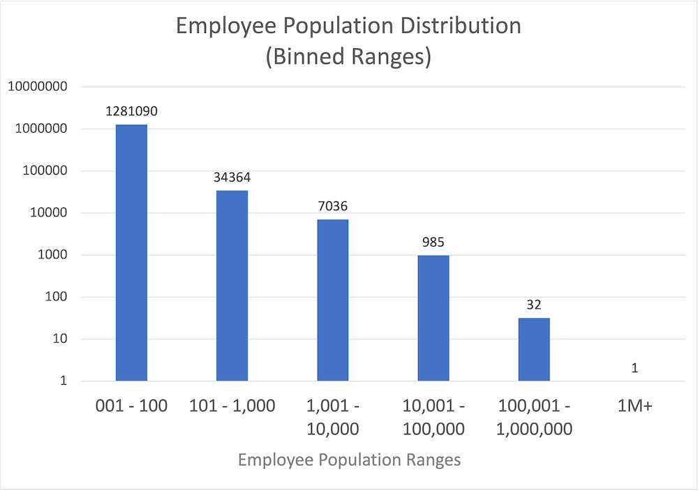

# azure_survey_2025
Results of scraping OneDrive from February 2022 - March 2025.  All data was collected via Microsoft APIs and OneDrive enumeration. 

***

For additional information, you can find the survey wordlists used here: https://github.com/nyxgeek/trontastic_usernames

My ShmooCon 20 talk (2025) can be found here: https://github.com/nyxgeek/shmoocon

## Contents
1. [General Statistics](#general-statistics)
   - [Overall Stats](#overall-stats)
   - [Fortune 500 Stats](#fortune-500-stats)
2. [ADFS Statistics](#adfs-statistics)
3. [User Statistics](#user-statistics)
   - [Initials](UPNs/initials.md)
   - [Nicknames](UPNs/nicknames.md)
   - [Numeric Usernames](UPNs/numeric.md)
   - [Service Accounts](UPNs/service_accounts.md)
   - [UPNs with digits appended (jsmith1, jsmith2)](UPNs/append_digits.md)
   - [Username Formats](UPNs/username_formats.md)
4. [Environments](#environments)
5. [Top TLDs](#top-tlds)
   - [Top TLDs by Number of Unique Domains](#top-tlds-by-domain-count)
   - [Maps - Total Domains per ccTLD](#top-country-code-tlds---total-domains)
   - [Top TLDs by Number of Users](#top-tlds-by-user-count)
   - [Maps - Total Users per ccTLD](#top-country-code-tlds---total-users)
6. [Bot Stats](#bot-stats)
7. [References](#references)

---

## General Statistics

Statistics on numbers and types of domains and tenants. Includes overall stats and Fortune 500 stats.

### Overall Stats
Some notes:
- "Live" refers to tenants or domains where users were identified
- The "OnMicrosoft" domain for a tenant is their default tenant domain (tenant_name.onmicrosoft.com).

  
```
Total Tenants:    4,033,132
Tenants with SharePoint Enabled:    1,946,381 (48%)
Tenants with OneDrive Enabled:     1,946,201 (48%)

Total Live Tenants:    1,032,350

Total Custom Domains: 7,053,874
Average Domains per Tenant: 1.74

Total domains identified with live users:    1,323,508 (19% of total custom domains)
    Live   Custom    Domains:      1,177,674
    Live OnMicrosoft Domains:        145,834


Azure Environments - All Organizations
+----------------+----------+
| environment    |    COUNT | 
+----------------+----------+
| commercial     |  4017640 |
| china          |    13498 |
| gcc            |      298 |
| dod            |        7 |
+----------------+----------+


Azure Environments - Live Tenants
+----------------+----------+
| environment    |    COUNT | 
+----------------+----------+
| commercial     |  1031625 |
| china          |      498 |
| gcc            |      263 |
| dod            |        4 |
+----------------+----------+


Total Custom Domains per Tenant
-------------------------------
Max: 4999
Mean: 1.99
Mode: 1

*LIVE* Custom Domains per Tenant
-------------------------------
Max: 374
Mean: 1.2856
Mode: 2
```


### Domain Sizes
```
+-------------------+--------------+
| user_range        | domain_count |
+-------------------+--------------+
| 001-100           |      1281090 |
| 101-1,000         |        34364 |
| 1,001-10,000      |         7036 |
| 10,001-100,000    |          985 |
| 100,001-1,000,000 |           32 |
| 1M+               |            1 |
+-------------------+--------------+
```



### Fortune 500 Stats

As noted, these numbers are from the 2024 Fortune 500 list. In this sample, the total number of tenant is differentiated from the total number of orgs because of the high prevalance of multi-tenant setups in large, Fortune 500 companies.

 

To reiterate:
- "Live" refers to tenants or domains where users were identified
- The "OnMicrosoft" domain for a tenant is their default tenant domain (tenant_name.onmicrosoft.com).
- "F500" will be used as shorthand for "Fortune 500"


```
Total F500 Orgs in Azure: 499 (99.8%)
  Total F500 Tenants: 809
F500 Organizations with multi-tenant config: 95 (19%)

Total F500 Orgs with SharePoint: 434
Total F500 Orgs with OneDrive: 431

Total F500 Tenants with SharePoint: 434
Total F500 Tenants with OneDrive: 431

Total F500 Live Orgs: 439
Total F500 Live Tenants: 557

Total F500 Custom Domains: 67,175
Average Domains per Org: 135
Average Domains per Tenant: 83
Average Tenants per Org: 1.6

   Total F500 Domains Identified with Live Users: 3,165 (5% of total custom domains)
      Live   F500  Custom   Domains:       3070
      Live F500 OnMicrosoft Domains:         95
   
   Average Live Domains per Live Org: 7.2
   Average Live Domains per Live Tenant: 5.7
   Average Live Tenants per Org: 1.3


Azure Environments - All Fortune 500 Orgs
+--------------+--------+
| environment  |  COUNT | 
+--------------+--------+
| commercial   |    488 |
| gcc          |     11 |
+--------------+--------+

Azure Environments - Live Fortune 500 Orgs
+--------------+--------+
| environment  |  COUNT | 
+--------------+--------+
| commercial   |    430 |
| gcc          |      9 |
+--------------+--------+


Total Custom Domains per Tenant
-------------------------------
Max: 2293
Mean: 121.69
Mode: 14

*LIVE* Custom Domains per Tenant
-------------------------------
Max: 338
Mean: 6.08
Mode: 1
```

#### Tenants per Organization - Count Sorted
```
Count   |  Number of Tenants
--------|-------------------
    343 |  1
     29 |  2
     17 |  3
     14 |  4
      9 |  7
      8 |  5
      4 |  9
      4 |  6
      3 |  10
      1 |  8
      1 |  25
      1 |  21
      1 |  18
      1 |  13
      1 |  12
      1 |  11
```

#### Tenants per Organization - Ordered by Number of Tenants
```
Count   |  Number of Tenants
--------|-------------------
    343 |  1
     29 |  2
     17 |  3
     14 |  4
      8 |  5
      4 |  6
      9 |  7
      1 |  8
      4 |  9
      3 |  10
      1 |  11
      1 |  12
      1 |  13
      1 |  18
      1 |  21
      1 |  25
```

### Domain Sizes

```
+-------------------+--------------+
| user_range        | domain_count |
+-------------------+--------------+
| 001-100           |         2127 |
| 101-1,000         |          649 |
| 1,001-10,000      |          301 |
| 10,001-100,000    |          210 |
| 100,001-1,000,000 |           11 |
+-------------------+--------------+
```


---

## ADFS Statistics

### ADFS Popularity - Overall
```
Overall
Total Tenants: 939,706
    ADFS: 98,344 (10.4%)
    Managed: 841,362 (89.5%)
```


### ADFS Popularity - Fortune 500
```
Fortune 500
Total Tenants: 499
    ADFS: 211 (42.3%)
    Managed: 288 (57.7%)
```


### Top External IDPs - Overall
```
71961   godaddy.com
5810 	okta.com
2551 	sso.duosecurity.com
1024 	secureserver.net
703 	onelogin.com
467 	google.com
203 	okta-emea.com
```

### Top External IDPs - Fortune 500
```
66	Okta
4	OneLogin
```

---

## User Statistics
*These are statistics on the usernames, or more appropriately, the UPNs (User Principal Names) which are unique identifiers in Entra ID.*

```
Total  usernames:    70,252,711    (2025.03.04)
Unique usernames:    14,410,943

Average users per domain: 59.65

Total days of  scraping:    1127
Usernames Found per Day:    62,336 usernames/day


Total Numeric Usernames  (1234, 12345, 123456):    10,405,919
Unique Numeric Usernames (1234, 12345, 123456):    4,066,717


Total Non-Numeric Usernames (jsmith, jsmith9):    59,799,886
Unique Non-Numeric Usernames (jsmith, jsmith9):    10,344,182

Total Usernames with Digit Appended  (jsmith9):    3,329,386
Unique Usernames with Digit Appended (jsmith9):    1,749,196

Unique base usernames (jsmith9 -> jsmith):    8,255,074

```
More user stats can be found within the UPNs folder.

#### Username Stats
- [Initials](UPNs/initials.md)
- [Nicknames](UPNs/nicknames.md)
- [Numeric Usernames](UPNs/numeric.md)
- [Service Accounts](UPNs/service_accounts.md)
- [UPNs with digits appended (jsmith1, jsmith2)](UPNs/append_digits.md)
- [Username Formats](UPNs/username_formats.md)


---

## Environments

### Overall Stats - Users per Azure Environment
```
+----------------+----------+
| source         | count(*) |
+----------------+----------+
| commercial     | 69847070 |
| gcc            |   336642 |
| dod            |    xxxxx |
| china          |    15551 |
+----------------+----------+
```

### Fortune 500 Stats - Users per Azure Environment
```
+--------------+----------+
| source       | COUNT(*) |
+--------------+----------+
| commercial   |  9582917 |
| gcc          |    52694 |
+--------------+----------+
```

---

## Top TLDs

### Top TLDs by Domain Count

In this list, all unique domains were considered. This reflects the range of domain TLDs.

```
 939056 com
 124646 org
  36076 uk
  34657 no
  19449 au
  15723 net
  11919 ca
  11039 nl
   9734 de
   7511 fr
   4691 edu
   4558 gov
   4142 za
   4028 it
   3829 us
   3820 co
   3537 be
   3417 es
   3318 in
   3285 se
```


### Top Country-Code TLDs - Total Domains


Full list: [top_tld_by_domain_count.txt](TLDs/top_tld_by_domain_count.txt)


### Top TLDs by User Count

In this list, all unique usernames (UPNs) were considered. This reflects the number of users and their UPN TLDs.

```
35415789 com
 9640870 edu
 7785823 org
 3086671 gov
 2215033 net
 1968785 uk
 1623449 br
 1610670 au
  984496 no
  816149 us
  709805 ca
  412149 pe
  351209 nl
  271255 pl
  241629 co
  199007 mx
  178381 it
  175622 in
  159490 za
  158896 sa
```

### Top Country-Code TLDs - Total Users


Full list: [top_tld_by_upn_count.txt](TLDs/top_tld_by_upn_count.txt)

---

## Bot Stats
```
Total machines employed over lifetime of project:    98
Average active machines:    33.64

Total machine-hours of scraping:    493,584
```

### Active Machines per Month
*Note: I only started tracking in March of 2023*
```
+---------+----------------+----------------------------------------------------------+
| month   | distinct_hosts |    1  <----------------------------------------->  49    |
+---------+----------------+----------------------------------------------------------+
| 2023-03 |    49          |    XXXXXXXXXXXXXXXXXXXXXXXXXXXXXXXXXXXXXXXXXXXXXXXXX     |
| 2023-04 |    49          |    XXXXXXXXXXXXXXXXXXXXXXXXXXXXXXXXXXXXXXXXXXXXXXXXX     |
| 2023-05 |    50          |    XXXXXXXXXXXXXXXXXXXXXXXXXXXXXXXXXXXXXXXXXXXXXXXXXX    |
| 2023-06 |    40          |    XXXXXXXXXXXXXXXXXXXXXXXXXXXXXXXXXXXXXXXX              |
| 2023-07 |    39          |    XXXXXXXXXXXXXXXXXXXXXXXXXXXXXXXXXXXXXXX               |
| 2023-08 |    30          |    XXXXXXXXXXXXXXXXXXXXXXXXXXXXXX                        |
| 2023-09 |    15          |    XXXXXXXXXXXXXXX                                       |
| 2023-10 |    15          |    XXXXXXXXXXXXXXX                                       |
| 2023-11 |    15          |    XXXXXXXXXXXXXXX                                       |
| 2023-12 |    15          |    XXXXXXXXXXXXXXX                                       |
| 2024-01 |    36          |    XXXXXXXXXXXXXXXXXXXXXXXXXXXXXXXXXXXX                  |
| 2024-02 |    42          |    XXXXXXXXXXXXXXXXXXXXXXXXXXXXXXXXXXXXXXXXXX            |
| 2024-03 |    30          |    XXXXXXXXXXXXXXXXXXXXXXXXXXXXXX                        |
| 2024-04 |    33          |    XXXXXXXXXXXXXXXXXXXXXXXXXXXXXXXXX                     |
| 2024-05 |    35          |    XXXXXXXXXXXXXXXXXXXXXXXXXXXXXXXXXXX                   |
| 2024-06 |    33          |    XXXXXXXXXXXXXXXXXXXXXXXXXXXXXXXXX                     |
| 2024-07 |    33          |    XXXXXXXXXXXXXXXXXXXXXXXXXXXXXXXXX                     |
| 2024-08 |    32          |    XXXXXXXXXXXXXXXXXXXXXXXXXXXXXXXX                      |
| 2024-09 |    32          |    XXXXXXXXXXXXXXXXXXXXXXXXXXXXXXXX                      |
| 2024-10 |    33          |    XXXXXXXXXXXXXXXXXXXXXXXXXXXXXXXXX                     |
| 2024-11 |    36          |    XXXXXXXXXXXXXXXXXXXXXXXXXXXXXXXXXXXX                  |
| 2024-12 |    48          |    XXXXXXXXXXXXXXXXXXXXXXXXXXXXXXXXXXXXXXXXXXXXXXXX      |
| 2025-01 |    45          |    XXXXXXXXXXXXXXXXXXXXXXXXXXXXXXXXXXXXXXXXXXXXX         |
| 2025-02 |    45          |    XXXXXXXXXXXXXXXXXXXXXXXXXXXXXXXXXXXXXXXXXXXXX         |
| 2025-03 |    11          |    XXXXXXXXXXX                                           |
+---------+----------------+----------------------------------------------------------+


```


## References

### General Azure Information:
- [Entra ID Terminology](https://learn.microsoft.com/en-us/entra/fundamentals/whatis#terminology) -- Covers tenants, custom domains, etc
- [Multi-Tenant Organizations](https://learn.microsoft.com/en-us/entra/identity/multi-tenant-organizations/multi-tenant-organization-overview)
- [OneDrive Enumeration - TrustedSec.com](https://trustedsec.com/blog/onedrive-to-enum-them-all)

### Microsoft APIs
- [GetUserRealm](https://login.microsoftonline.com/getuserrealm.srf?login=nyxgeek@microsoft.com&xml=1) - General Information from domain name, shows whether managed or ADFS
- [AutoDiscover](https://aadinternals.com/post/just-looking/) - AADInternals post. Great writeup by Dr Nestori. Entire site is a great resource.
