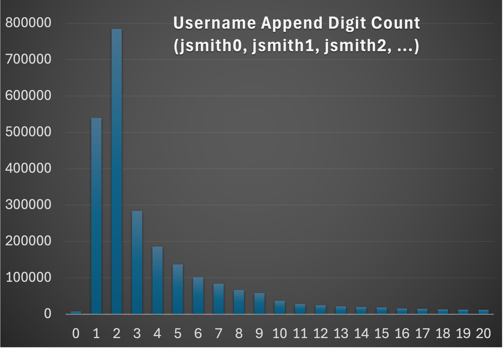
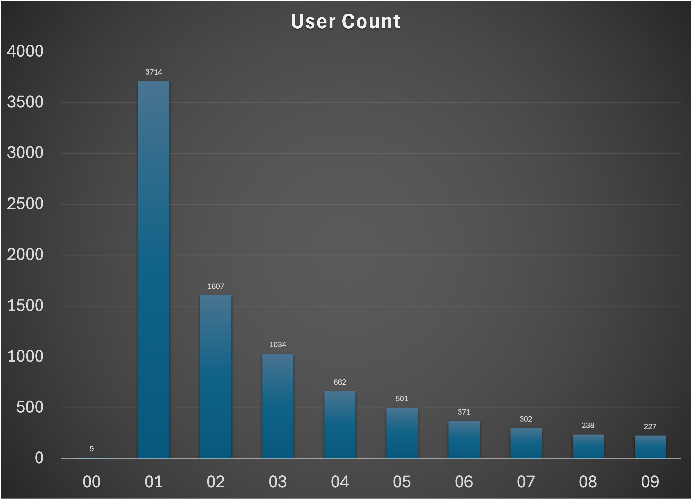

# Statistics on Appended Digits to Usernames

Many companies will append a digit to a username when they "run out of space" and start running into username collisions.

E.g.: jsmith -> jsmith1, jsmith2, jsmith3, etc


### Overall Usage Counts

#### Background Info:
```
Total domains tested:
Total tenants tested:
Total domain/tenants tested:
```

#### Organizations Found Using Append Digits
```
Unique Domains using append digits:
Unique Tenants using append digits:
Unique Domain/Tenants using append digits:
```


### Popularity - Formats

jsmith
smithj
john.smith
smith.john
john
smith


### Append Numbers

Most popular 'append' numbers:
```
```




