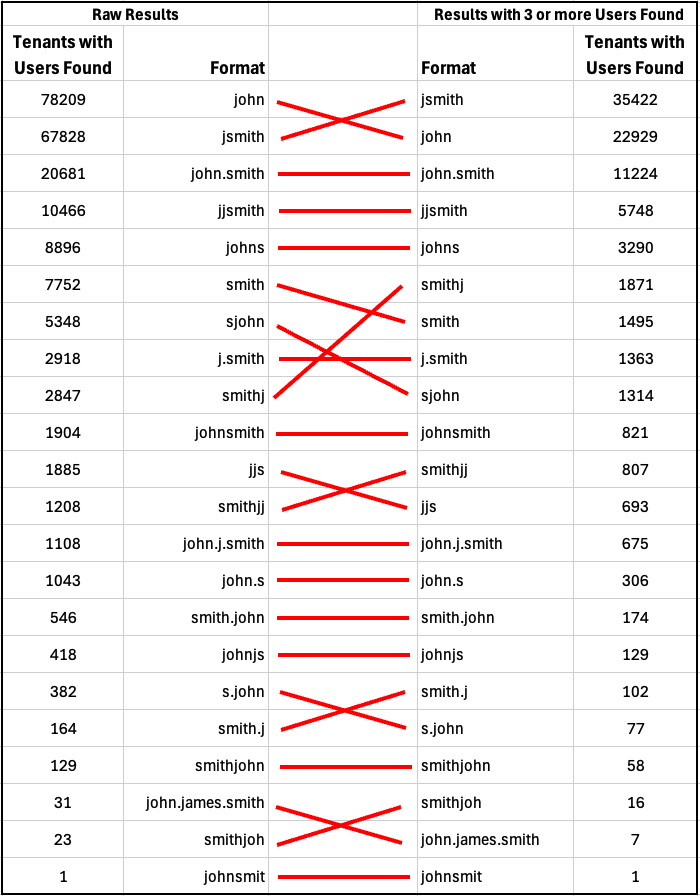
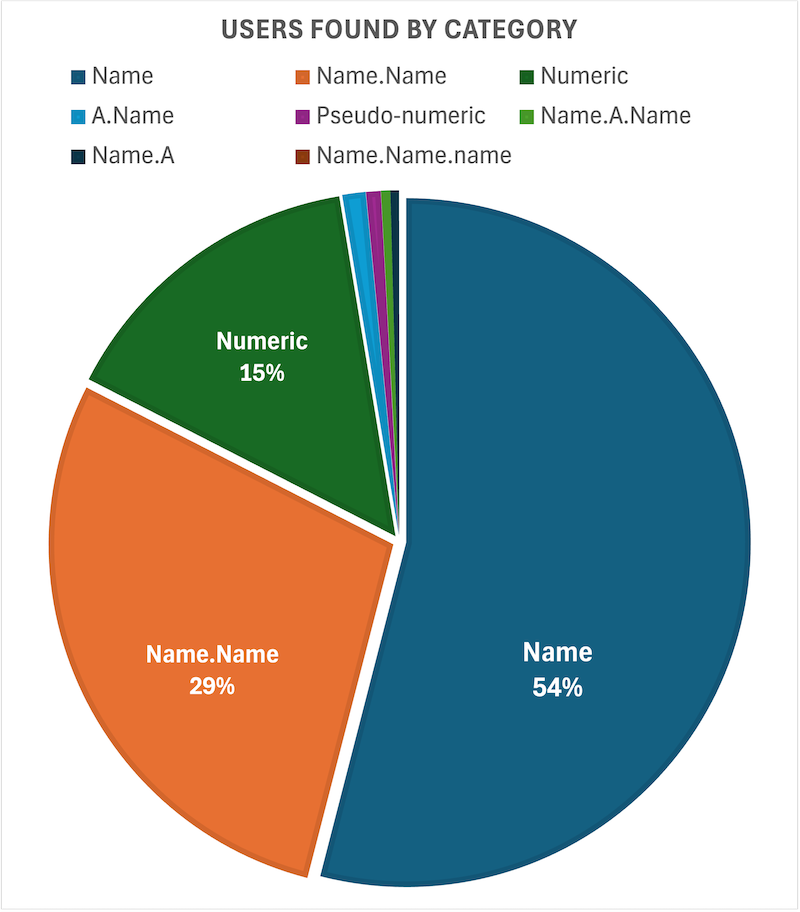

# Statistics on Username Formats


### Top Username Formats - By Number of Tenants

Results with 3 or more found usernames of a given format

```
+-----------------------+---------------+
| userlist              | total_tenants |
+-----------------------+---------------+
| jsmith_15x5.75        |         35422 |
| john.50               |         22929 |
| john.smith_10x50.500  |         11224 |
| jjsmith_10x5x10.500   |          5748 |
| johns_5x15.75         |          3290 |
| smithj_5x15.75        |          1871 |
| smith.50              |          1495 |
| j.smith_15x5.75       |          1363 |
| sjohn_15x5.75         |          1314 |
| johnsmith_10x50.500   |           821 |
| smithjj_10x5x10.500   |           807 |
| jjs_4x5x5.100         |           693 |
| john.j.smith.1000     |           675 |
| john.s_5x15.75        |           306 |
| smith.john_50x10.500  |           174 |
| johnjs_5x10x10.500    |           129 |
| john.j.smith.250      |           115 |
| smith.j_5x15.75       |           102 |
| s.john_15x5.75        |            77 |
| smithjohn_50x10.500   |            58 |
| smithjoh_10x50.186    |            16 |
| john.james.smith.3600 |             7 |
| johnsmit_10x50.178    |             1 |
+-----------------------+---------------+
```


Unfiltered Results with 1 or more found (likely false positives)

```
+-----------------------+---------------+
| userlist              | total_tenants |
+-----------------------+---------------+
| john.50               |         78209 |
| jsmith_15x5.75        |         67828 |
| john.smith_10x50.500  |         20681 |
| jjsmith_10x5x10.500   |         10466 |
| johns_5x15.75         |          8896 |
| smith.50              |          7752 |
| sjohn_15x5.75         |          5348 |
| j.smith_15x5.75       |          2918 |
| smithj_5x15.75        |          2847 |
| johnsmith_10x50.500   |          1904 |
| jjs_4x5x5.100         |          1885 |
| smithjj_10x5x10.500   |          1208 |
| john.j.smith.1000     |          1108 |
| john.s_5x15.75        |          1043 |
| smith.john_50x10.500  |           546 |
| johnjs_5x10x10.500    |           418 |
| s.john_15x5.75        |           382 |
| john.j.smith.250      |           223 |
| smith.j_5x15.75       |           164 |
| smithjohn_50x10.500   |           129 |
| john.james.smith.3600 |            31 |
| smithjoh_10x50.186    |            23 |
| johnsmit_10x50.178    |             1 |
+-----------------------+---------------+
```

Comparison



---

### Top Username Formats - By Total User Population


#### Top Format Catgegories - Grouped by Delimiter
The most *reliable* way to categorize usernames is by their delimiter placement.

| Format (By Delimiter) | Examples                         | Users Found |
| --------------------- | -------------------------------- | ----------- |
| Numeric               | 12345                            | 10,405,919  |
| Pseudo-numeric        | ab1234                           | 479,049     |
| Name                  | jsmith,     johns,          john | 37,827,380  |
| Name.Name             | john.smith,  smith.john          | 19,970,013  |
| A.Name                | j.smith,    s.john               | 762,411     |
| Name.A                | john.s,    smith.j               | 279338      |
| Name.A.Name           | john.j.smith                     | 300,236     |
| Name.Name.Name        | john.james.smith                 | 9,216       |
|                       |                                  |             |
|                       | Calculated Total                 | 70,033,562  |
|                       | Scraped Total                    | 70,664,775  |
|                       | Percent Accounted For            | 0.9910675   |


 




